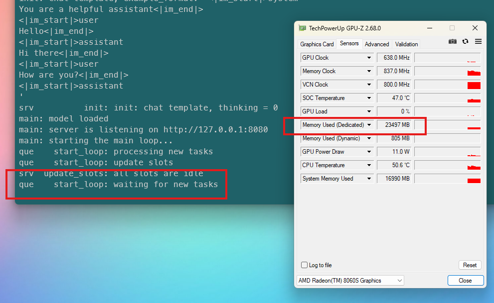

# Resources for running Llama.cpp locally

## :movie_camera: Background

I have explored running language models locally using [LM Studio](https://lmstudio.ai/), and [Ollama](https://ollama.com/).

Under the hood both of these tools use [Llama.cpp](https://github.com/ggml-org/llama.cpp) runtimes.

I am now exploring using Llama.cpp directly to run local LLMs, primarily as a server for integration into applications and CLIs.

## :white_check_mark: Scope

- [x] Configure Llama.cpp environment.
- [x] Create script to execute Llama.cpp with predefined parameters.
- [x] Add support for multiple LLMs.
- [x] Support per-model parameters, for tweaking settings based on model performance.
- [x] Integrate into OpenCode.
- [x] Identify method for verifying GPU offload.
- [x] Apply AI generated optimial llama-server parameter values.

## :telescope: Future Gazing

- [ ] Design method of benchmarking performance, automate repeatable tests.
- [ ] Apply improvements to each model execution using benchmarking results.

## :beetle: Known defects

No known defects.

## :crystal_ball: Use of AI

[GitHub Copilot](https://github.com/features/copilot) was used to assist in the development of this software.

## :rocket: Getting Started

### :computer: System Requirements

#### Software

> [!NOTE]
> Other operating systems and versions will work, where versions are specified treat as minimums.

> [!NOTE]
> TechPowerUp's [GPU-Z](https://www.techpowerup.com/gpuz/) is optional. This application provides a simple method of verifying GPU offload.

#### Hardware

A system capable of running Llama.cpp is required.

Details of my personal system are below.

> [!NOTE]
> The hardware in use on my PC includes an Accelerated Processor Unit (APU) which combines CPU and GPU on a single chip. Llama.cpp is focused on supporting a [wide range of hardware](https://github.com/ggml-org/llama.cpp?tab=readme-ov-file#description). Performance will depend upon your hardware, the use of CPU v GPU, the models you choose to run and other operational factors.

### :floppy_disk: System Configuration

Installation of Llama.cpp via Winget, no other configuration needed.

> [!NOTE]
> Works on my machine!

### :wrench: Development Setup

Clone the repository.

Download supported models, place models within the `models` directory.

> [!NOTE]
> The repository shows which models I am currently experimenting with. The script currently hardcodes their values.

Scripts can be executed within the VS Code terminal window, or via any other supported terminal e.g. Windows Terminal.

> [!NOTE]
> The scripts are opinionated, they are hardcoded to use Windows Terminal when launching new Llama.cpp servers.

## :zap: Features

- Asks user on each execution whether they wish to update Llama.cpp.
- Asks user which model they wish to run.
- Runs the model in a new Windows Terminal window.

## :paperclip: Usage

Run `start-llama-cpp.bat` in your preferred terminal.

Run GPU-Z to verify GPU offload:

## :raised_hands: Thanks

Thanks to [Nico Domino](https://github.com/ndom91) who shared his [GLM-4.7-Flash Strix Halo Docker setup](https://github.com/ndom91/GLM-4.7-Flash-Strix-Halo), I used this as a basis for running my own local Llama.cpp server.

Thanks also to the open source contributors of [Llama.cpp](https://github.com/ggml-org/llama.cpp).

## :wave: Contributing

This repository was created primarily for my own exploration of the technologies involved.

## :gift: License

I have selected an appropriate license using [this tool](https://choosealicense.com/).

This software is licensed under the [MIT](LICENSE) license.

## :book: Further reading

More detailed information can be found in the documentation:
* [Resources](docs/resources.md)
* [llama-server parameters](docs/llama-server-parameters.md)